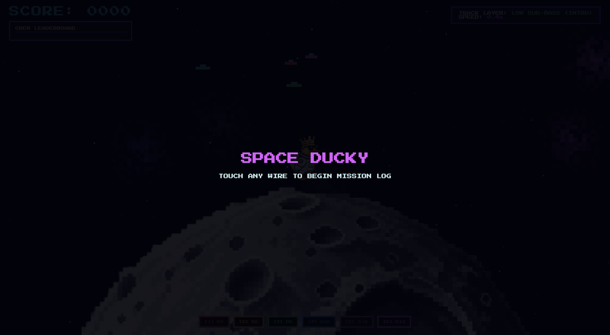
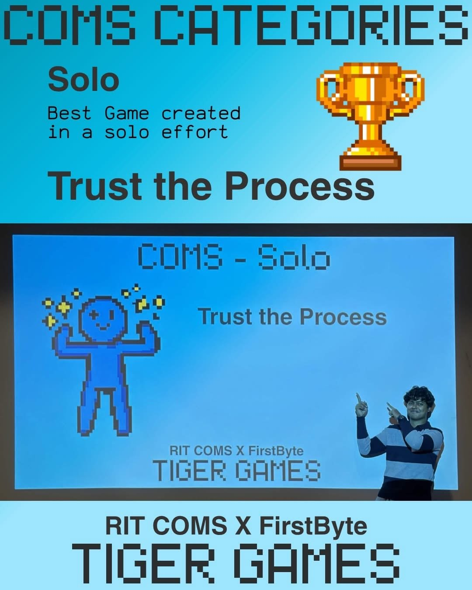
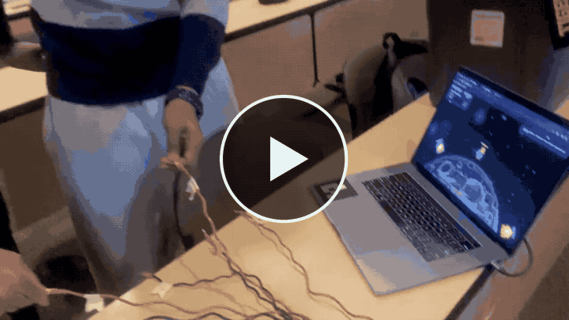
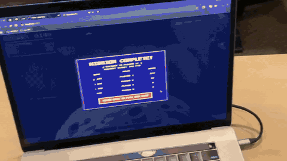
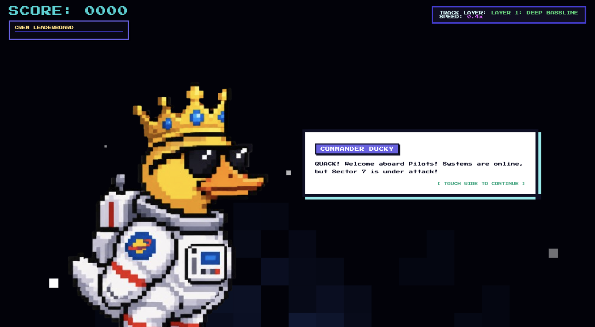
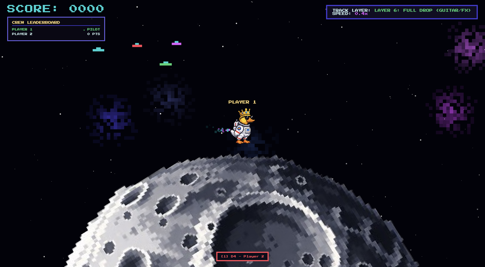
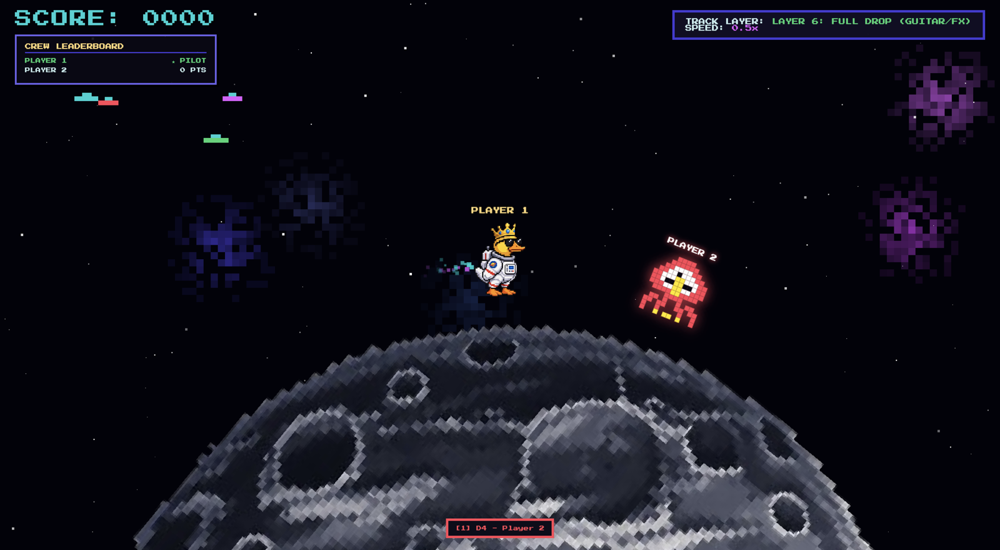
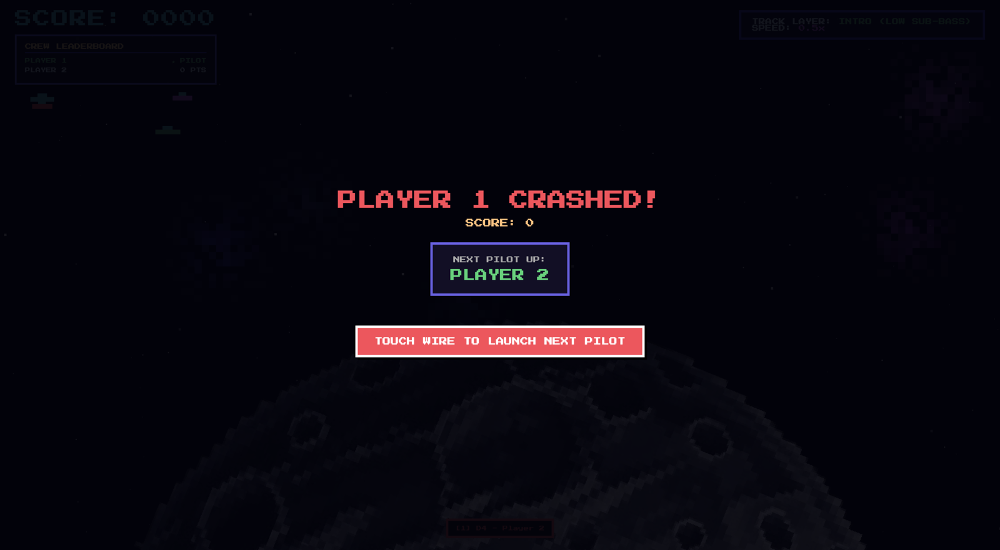
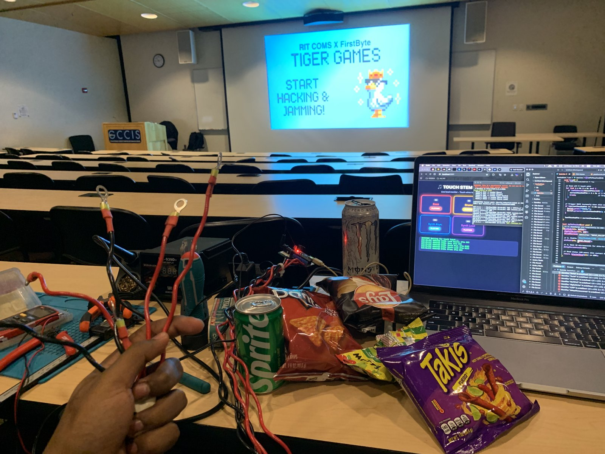
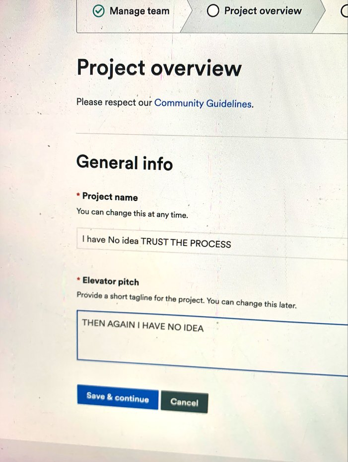

# 🦆 Space Ducky



**Winner, Best Solo Game at Tiger Games '26** (8-hour game jam hosted by the Computing Organization for Multicultural Students at RIT (COMS) and FirstByte).

Space Ducky is a cooperative multiplayer arcade survival game where **real-world physical contact is the only way to play**. There is no plastic controller. The controller is the connection between people: players high five, hold hands, or tap arms to close a low-voltage bio-conductive circuit and cross obstacles.

## The win



## Why

We play multiplayer games all the time, but the "friends" we meet online often stay completely virtual. Space Ducky is built so that playing together turns strangers into real-life friends.

## How it plays

Up to six players gather around the screen in person. As alien obstacles approach, the game calls out a specific player's name and assigned colour. To clear it, you have to know who that person is, so players introduce themselves, learn each other's names, and make contact. A handshake or high five between the right players closes the circuit and spawns a shield on screen. Miss it and the duck crashes, then the next pilot takes a turn. Highest score wins the crew leaderboard.

Background music is layered from generated audio stems (sub-bass, bassline, drums, synth keys, lead, piano arps, full drop) and each new touch adds another layer.

## Demo

**Playing it with other people** (click to watch with sound)

[](https://github.com/tajwarTX/space-ducky/raw/refs/heads/main/docs/videos/demo.mp4)

**The full setup and wiring walkthrough**

[](https://github.com/tajwarTX/space-ducky/raw/refs/heads/main/docs/videos/setup-walkthrough.mp4)

## Screenshots

| Meet Commander Ducky | Gameplay |
|---|---|
|  |  |
| **An alien calls out a player** | **Crash screen, next pilot up** |
|  |  |

## How it works

```
 Players (skin contact)
        │
 Copper-wire leads ──► Arduino Nano (bio-capacitive sensing, debounce)
        │  serial, 230400 baud  ("TOUCH_1" … "TOUCH_N")
        ▼
 Python backend (pyserial + Flask-SocketIO)
        │  WebSocket event: update_stem
        ▼
 Browser game (HTML5 Canvas + Web Audio)
```

1. **Sensor circuit:** built from raw components on a veroboard as a prototype.
2. **Leads:** stripped copper wires routed into multi-channel leads read micro-current changes through skin when two players make contact.
3. **Firmware:** the Arduino Nano discharges each pin, charges it through `INPUT_PULLUP`, and reads it back after 15 µs. A pin pulled LOW means skin contact. Each pin is double-checked 1 ms apart and has a 600 ms per-pin cooldown to reject static and skin chatter.
4. **Backend:** `play.py` reads the serial stream, de-duplicates triggers, and pushes them to the browser over Socket.IO.
5. **Game:** HTML5 Canvas with Socket.IO, procedural Web Audio music that layers in as players connect, and a keyboard fallback (keys `1` to `6`).

All of this was built within the 8 hours.

## Repo layout

```
space-ducky/
├── assets/                              # duck.svg and moon.svg sprites
├── docs/images/                         # screenshots and photos used in this README
├── docs/videos/                         # demo and setup walkthrough clips
├── play.py                              # Flask + Socket.IO server and the whole game frontend
├── firmware/touch_trigger/touch_trigger.ino   # Arduino Nano touch-sensing sketch
├── requirements.txt
└── LICENSE
```

## Running it

**Hardware:** Arduino Nano with one stripped-copper wire lead per player on pins D4, D6, D8, D10, D12 (D13 for a sixth player). See the setup walkthrough video above for the wiring.

1. Flash `firmware/touch_trigger/touch_trigger.ino` to the Arduino at 230400 baud.
2. Install dependencies:
   ```bash
   python3 -m venv .venv && source .venv/bin/activate
   pip install -r requirements.txt
   ```
3. Sprites live in `assets/` (`duck.svg`, `moon.svg`). The server picks the first image whose filename contains `duck` or `moon`, checking `assets/` first, then `~/Downloads` and `~/Desktop`.
4. Start the game with the Arduino plugged in:
   ```bash
   python play.py
   ```
5. Open <http://localhost:5001>.

The serial port is auto-detected on macOS (`/dev/cu.usbserial*` or `/dev/cu.usbmodem*`).

**No hardware?** Press keys `1` to `6` in the browser to simulate wire touches.

## Known notes

- The sketch currently drives 5 channels; the game supports 6. To add the sixth, extend `touchPins` to `{4, 6, 8, 10, 12, 13}` and loop to 6.
- The hardest part was tuning thresholds across different skin resistance levels.

## Behind the scenes

Built in one 8-hour sitting at RIT: a soldering station, a multimeter, and a lot of snacks.



When it came time to fill out the Devpost submission I had no idea what to call the project, so the team name became **"I have No idea TRUST THE PROCESS"**. It worked out.



## Thanks

[Major League Hacking](https://www.linkedin.com/company/major-league-hacking/) and [Google Cloud](https://www.linkedin.com/showcase/google-cloud/) for supporting the event, the organizers at COMS, FirstByte, and RIT, and everyone who came out and played.

## Author

Mahir Tajwar Chowdhury, Electrical Engineering (Robotics), RIT.
